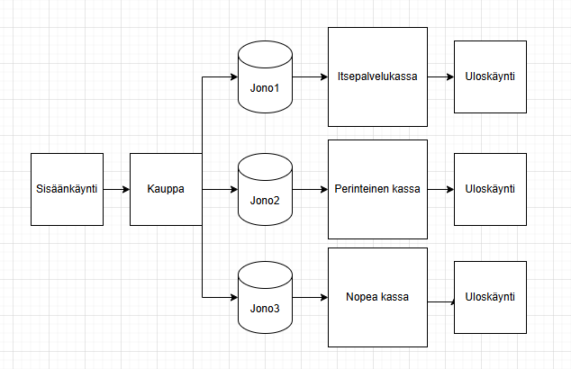
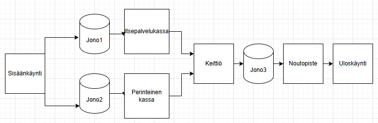

(W) Design two different systems of three or four service points for a real-world destination. Use real-world concepts. Draw diagrams using the graphical representation of a service point shown in section ´Performance Variables´.

Esim 1

Sisäänkäynti  
Kauppa  
Servicepoints: 
Kassat (itsepalvelukassa, perinteinen kassa, nopea kassa (max 5 tuotetta))  
Poistuminen

Esim2

Pikaruokaravintola

Sisäänkäynti  
Servicepoints: Itsepalvelukassa, Perinteinen kassa, noutopiste  
Keittiö  
poistuminen 

